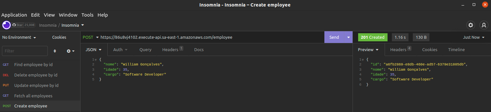
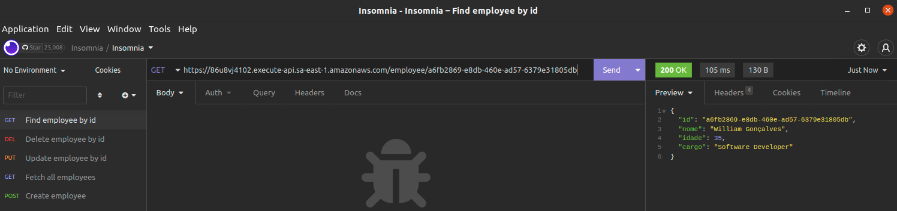
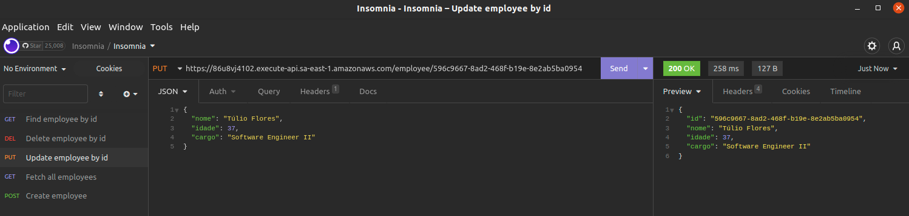
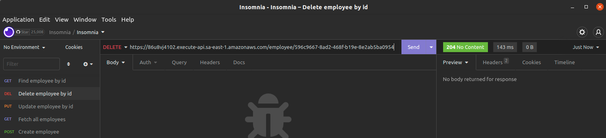

# _Serverless Challenge_

> Solução serverless AWS para o processo seletivo da Stefanini.<br><br>_O desafio proposto está disponível em: https://github.com/dornellas13/serverless-challenge_

## Decisões

### Uso do NoSQL DynamoDB como banco de dados

O banco de dados DynamoDB foi escolhido por dar flexibilidade ao schema, permitindo salvar dados no formato JSON praticamente de maneira direta, ser de fácil integração utilizando o AWS-SDK e muito utilizado em soluções serverless da AWS.

### Disponibilização da função lambda através de rotas configuradas no API Gateway

Como foi solicitado que apenas uma função lambda permitisse as operações de cadastro, consulta, atualização e deleção, e que estivesse exposta à Internet, foi escolhido disponibilizar rotas à ela através do API Gateway, como se tivéssemos uma REST API disponível.

### Uso do Serverless Framework para o deploy da solução e o provisionamento da infraestrutura na AWS

Por ser flexível a muitos provedores serverless e permitir o provisionamento "programável" de recursos das diversas nuvens, o Serverless Framework foi escolhido para o deploy da solução desenvolvida.

## Utilização da solução e evidências

A solução está disponível para testes e pode ser utilizada como uma REST API através do URL base `https://86u8vj4102.execute-api.sa-east-1.amazonaws.com`

| Método   | Endpoint         | _Payload_                                      | Descrição                                                        |
| -------- | ---------------- | ---------------------------------------------- | ---------------------------------------------------------------- |
| `POST`   | `/employee`      | _Body em JSON_ <sup>[1]</sup>                  | Cadastra um funcionário. O ID criado no registro será retornado. |
| `GET`    | `/employee/{id}` | _Path parameter_                               | Consulta os dados de um funcionário, dado o seu ID.              |
| `GET`    | `/employee`      |                                                | Retorna todos os funcionários cadastrados.                       |
| `PUT`    | `/employee/{id}` | _Path parameter e body em JSON_ <sup>[1]</sup> | Atualiza o cadastro completo de um funcionário, dado o seu ID.   |
| `DELETE` | `/employee/{id}` | _Path parameter_                               | Remove o cadastro de um funcionário, dado o seu ID.              |

```json
// [1] - Exemplo de body em JSON que deve ser passado a alguns endpoints:
{
    "nome": "William Gonçalves",
    "idade": 35,
    "cargo": "Desenvolvedor de software"
}

/* Seguindo o proposto pelo desafio, a API está preparada para tratar o
recebimento dos atributos "nome", "idade" e "cargo". */
```

### Evidências da solução em funcionamento

**Inclusão do funcionário:**


**Busca do funcionário pelo seu id:**


**Busca de todos os funcionários, após inclusão de um novo funcionário:**


**Atualização das informações de um funcionário:**


**Remoção de um funcionário e busca após remoção:**




**"Bad requests" são lançados ao usuário (neste caso, erro no nome de um atributo JSON):**


## Como implantar este projeto na AWS

1. Ter uma conta na AWS;
2. Instalar globalmente o Serverless Framework, por exemplo através do comando `npm install -g serverless` (`sudo` talvez seja requido);
3. Criar um usuário na AWS para o uso do Serverless Framework e registrar suas credenciais nele, de maneira parecida ao comando `serverless config credentials -o --provider aws --key=ACCESS_KEY_ID --secret SECRET_ACCESS_KEY`, substituindo as informações conforme fornecidas pela AWS;
4. Após o clone e dentro do diretório deste projeto, instalar este projeto com o comando `npm install`;
   4.1. Se desejado, após a instalação, testes unitários e de integração básicos podem ser executados através do comando `npm test`.
5. Revisar e/ou adaptar, via arquivo _serverless.yml_, as variáveis de ambiente, os endpoints e os recursos configurados para o provisionamento no deploy;
6. Validar o arquivo _serverless.yml_ e confirmar a configuração através do comando `serverless` (passo necessário apenas antes do primeiro deploy);
7. Implantar a solução através do comando `npm run deploy`;
8. Testar os endpoints disponibilizados pela solução, que são informados pelo Serverless Framework ao fim do processo de deploy;
9. Após os testes, a remoção da função lambda e dos outros recursos provisionados na AWS pode ser feita através do comando `npm run remove`.

## Observações

1. O identificador do funcionário ou é gerado e atribuído no momento de sua criação, ou precisa ser informado no URL para algumas requisições (ver endpoints acima), portanto nunca precisará ser passado nos corpos de requisições como JSON.
2. Para testar os endpoints criados na AWS, você pode usar as aplicações Postman ou Insomnia. Há também plataformas do tipo, para testes de endpoints, que rodam diretamente navegador.

## Importante

Embora a solução seja uma "prova de conceito" ao desafio, na maioria das vezes não é recomendado disponibilizar uma API para a gestão de recursos atrás de uma ou mais funções lambda. Isto porque, dependendo do uso da API, pode não ser o modelo ideal de arquitetura. Por exemplo, o custo das execuções de tais funções pode se tornar muito oneroso e o cliente pode experimentar um delay maior no processamento de uma requisição, como em "cold starts" dependendo da configuração.

Caso use esta solução como estudo/inspiração, leve esses pontos em consideração ao planejar soluções serverless que precisarão ser produtivas.
